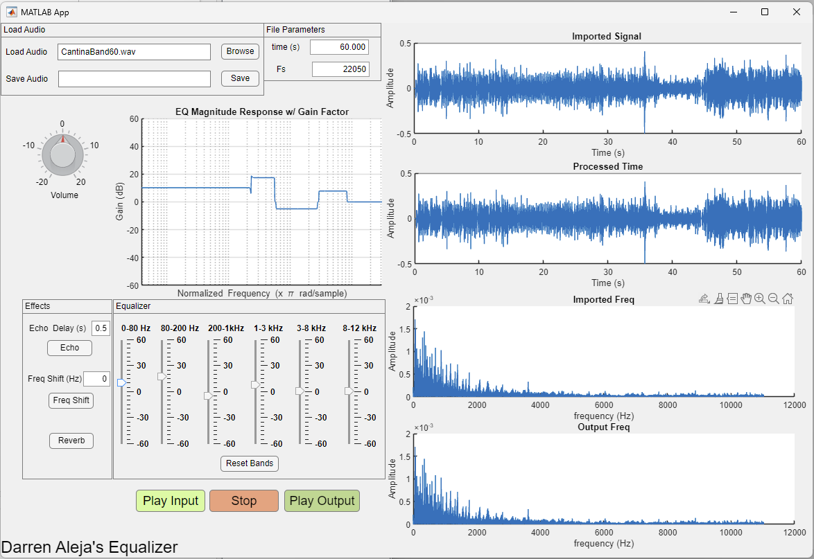

# Multi-band Equalizer MATLAB App
An equalizer toolbox built in MATLAB App Designer.

  
   
  <em>Equalizer in MATLAB App Designer</em>

## Installation Process
1. For those who have MATLAB installed, please run and open the application using MATLAB App Designer.
2. For those who do not have access to MATLAB, please install MATLAB Compiler Runtime. This is free to download and allows the execution of compiled MATLAB applications without MATLAB. Run the executable there after to utilize the software.

